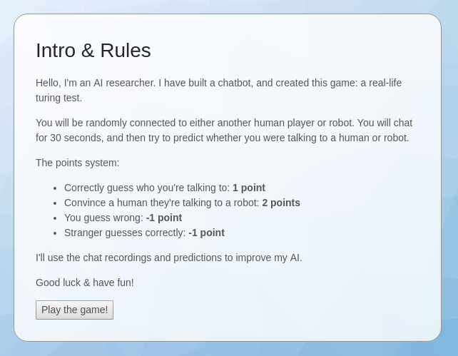

# Fake Turing Test

I invited users to participate in a Real-Life Turing Test [[link](https://news.ycombinator.com/item?id=17219885)]. Users were connected to strangers and asked to predict whether they were a human or robot. However, everyone was a human and the scores were randomised, tricking users into believing they were talking with an advanced AI.

See the [live experiment](https://turing-game.tech/) & [dataset](https://www.kaggle.com/ashtonsix/fake-turing-test) (2,678 chats).

